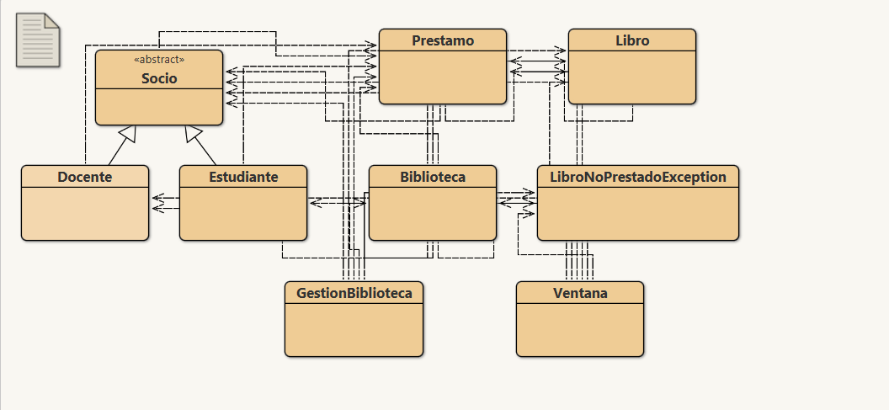

# 📚 Sistema de Gestión de Biblioteca

Proyecto integrador de software desarrollado en **Java**, centrado en la aplicación rigurosa del **Paradigma de Programación Orientada a Objetos (POO)**. Implementa la lógica de negocio completa para la administración de préstamos, socios (docentes y estudiantes), catálogo bibliográfico y control de vencimientos[cite: 6].

---

## 🚀 Descripción del Proyecto

El sistema modela el funcionamiento integral de una biblioteca institucional:
- **Gestión de Socios Polimórfica:** Distingue entre socios `Estudiante` y `Docente`, aplicando reglas de negocio específicas para cada rol a través de herencia y sobreescritura de métodos[cite: 6].
- **Control de Préstamos y Fechas:** Registro de fechas de retiro y devolución mediante la API `Calendar`, cálculo dinámico de plazos y vencimientos[cite: 6].
- **Reglas de Negocio Estrictas:**
  - **Estudiantes:** Límite máximo de 3 libros simultáneos en su poder y plazo de devolución de hasta 20 días sin vencimientos activos[cite: 6].
  - **Docentes:** Sin límite de cantidad de libros, plazo base de 5 días con posibilidad de bonificación de días adicionales (`cambiarDiasDePrestamo`) y control de historial para determinar "docentes responsables" (aquellos que jamás devolvieron fuera de término)[cite: 6].
- **Manejo de Excepciones Propias:** Control de flujos anómalos (por ejemplo, intentar devolver o buscar un libro que no se encuentra prestado) mediante la excepción personalizada `LibroNoPrestadoException`[cite: 6].
- **Informes y Listados:** Generación estructurada de estadísticas (socios por tipo, títulos disponibles sin duplicados, préstamos vencidos, socio poseedor de un ejemplar, listados de docentes responsables)[cite: 6].

---

## 🏛️ Conceptos de POO Aplicados

- **Abstracción y Encapsulamiento:** Ocultamiento del estado interno mediante modificadores de acceso privados y métodos públicos de consulta/modificación[cite: 6].
- **Herencia:** Jerarquía con clase abstracta base `Socio` y clases derivadas concretas `Estudiante` y `Docente`[cite: 6].
- **Polimorfismo:** Sobreescritura de comportamiento en validaciones (`puedePedir()`) e identificación de tipos (`soyDeLaClase()`)[cite: 6].
- **Colecciones Genéricas (`java.util.*`):** Uso de `ArrayList<T>` para el manejo tipado y seguro de listas de préstamos, libros y socios[cite: 6].
- **Manejo de Errores Robusto:** Creación y lanzamiento de excepciones de dominio personalizadas (`LibroNoPrestadoException`)[cite: 6].

---

## 📐 Diagrama de Clases (BlueJ)



---

## 🧩 Principales Clases y Arquitectura

### Capa de Dominio (Modelo)
* **`Socio.java` (Clase Abstracta):** Modela atributos base (`dniSocio`, `nombre`, `diasPrestamo`) y define el contrato polimórfico de los socios[cite: 6].
* **`Docente.java`:** Subclase con gestión de área docente, cálculo de docentes responsables y adición de días por conducta (`cambiarDiasDePrestamo`)[cite: 6].
* **`Estudiante.java`:** Subclase con control de carrera y verificación de cupo máximo de 3 libros (`puedePedir`)[cite: 6].
* **`Libro.java`:** Administra la información bibliográfica y el historial de préstamos del ejemplar (`ultimoPrestamo`, `prestado`)[cite: 6].
* **`Prestamo.java`:** Registra la asociación entre socio, libro, fecha de retiro y cálculo de vencimiento (`vencido`)[cite: 6].
* **`LibroNoPrestadoException.java`:** Excepción propia que asegura la consistencia en devoluciones y consultas de estado[cite: 6].

### Capa Controladora
* **`Biblioteca.java`:** Controlador central que administra colecciones genéricas (`ArrayList`), orquesta préstamos/devoluciones y emite los listados formateados[cite: 6].

### Capa de Presentación / Ejecución
* **`GestionBiblioteca.java`:** Clase ejecutable (`main`) que inicializa objetos del modelo, simula escenarios de prueba y emite listados por consola[cite: 3, 6].
* **`Ventana.java`:** Interfaz gráfica de usuario (GUI) que permite operar interactivamente con la biblioteca.

---

## 🛠️ Tecnologías y Herramientas

* **Lenguaje:** Java (JDK 8+)
* **Entorno de Desarrollo (IDE):** BlueJ
* **Control de Versiones:** Git y GitHub
* **Gestión y Metodología:** Organización de tareas mediante tablero Trello

---

## 💻 Ejecución del Proyecto

### Opción 1: Desde BlueJ
1. Clona o descarga este repositorio.
2. Abre **BlueJ** y selecciona **Proyecto** > **Abrir proyecto...**.
3. Selecciona la carpeta raíz descargada.
4. Haz clic derecho sobre la clase `GestionBiblioteca` o `Ventana` y selecciona `void main(String[] args)`.

### Opción 2: Desde Terminal / Consola
```bash
# 1. Compilar los archivos Java
javac *.java

# 2. Ejecutar la consola principal
java GestionBiblioteca